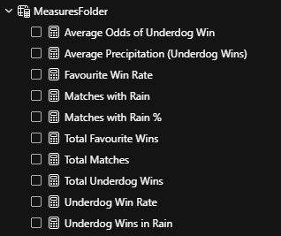

# AFL Historic Data Enrichment Project

## Project Overview

This project enhances historical AFL match data by:

-   Cleaning and standardizing raw data.
-   Identifying the winning team.
-   Geocoding match venues to retrieve their latitude and longitude.
-   Enriching the data with weather information (specifically precipitation) on the match day.
-   Preparing a clean, enriched dataset ready for analysis and visualization.

## Input and Output

| File                    | Description                                                                    |
| :---------------------- | :----------------------------------------------------------------------------- |
| `afl.xlsx`              | Raw AFL data including match details, scores, and betting odds.                |
| `Historic_AFL_Data.csv` | Cleaned and enriched AFL dataset including venue coordinates and weather data. |

## Technologies

-   Python: Data manipulation and automation
-   Pandas: Data wrangling
-   Google Maps API: Geocoding venue addresses
-   Meteostat API: Retrieving historical weather data
-   Jupyter Notebook: Development environment
-   Power BI: Data visualization and dashboard creation

## Key Steps

1. **Data Loading and Selection**  
   Load the raw data from Excel and select only the columns required for analysis.

    ```python
    import pandas as pd

    # Load data
    df = pd.read_excel('afl.xlsx', sheet_name=0, skiprows=1)

    # Select relevant columns
    df = df[['Date', 'Kick Off (local)', 'Home Team', 'Away Team', 'Venue',
             'Home Score', 'Away Score', 'Play Off Game?', 'Home Odds Close', 'Away Odds Close']]
    ```

2. **Winning Team Column**
   Created a function that can be appliead to a Dataframe Column. This function identifies the winning team by checking if the Home or Away team had the greater score

    ```python
    # Add Winning Team
    def get_winner(row):
        if row['Home Score'] > row['Away Score']:
            return row['Home Team']
        elif row['Home Score'] < row['Away Score']:
            return row['Away Team']
        else:
            return "Draw"

    df['Winning Team'] = df.apply(get_winner, axis=1)
    ```

3. **Standardise Venue Names**
   Some of the venue names will not produce the desired location when plugged into the Google maps api. Hence these locations names were replaced with venue names that produce the desired location.

    ```python
        # Standardize Venue Names
    df['Venue'] = df['Venue'].replace({
        'SCG': 'Sydney Cricket Ground',
        'Domain Stadium': 'Mueller Park',
        'Marvl': 'Marvel Stadium'
    })
    ```

4. **Geocode Venues to Get Coordinates**
   Using a for loop, I looped through the distinct values in the Venues column and plugged them into the GeoCoding API. This returned a corresponding Latitude and Longitude value for each venue.

    ```python
    import googlemaps
    import time
    import random

    # Initialize Google Maps Client
    gmaps = googlemaps.Client(key='YOUR_API_KEY')

    location_list = {}

    # Fetch coordinates for each unique venue
    for value in df['Venue'].unique():
        for attempt in range(3):  # Retry up to 3 times
            try:
                result = gmaps.geocode(value)
                if result:
                    location_list[value] = result[0]['geometry']['location']
                    break
                else:
                    time.sleep(random.uniform(1, 3))
            except Exception as e:
                print(f"Error fetching location for {value}, retrying... ({attempt+1}/3)")
                time.sleep(random.uniform(1, 3))
    ```

5. **Map Coordinates back to the DataFram**
   Added a longitude and latitude column to the DataFrame using the map method and lambda functions

    ```python
        # Map coordinates back to dataframe
    df["lat"] = df["Venue"].map(lambda x: location_list.get(x, {}).get("lat"))
    df["long"] = df["Venue"].map(lambda x: location_list.get(x, {}).get("lng"))
    ```

6. **Fetch Rainfall Data for Each Match**
   Using the Meteostat Python Library, the precipitation figure for each matchday was fetched and mapped to a "Weather" column. This used the Meteo "Point" and "Daily" function. "Point" creates a location object based on longitude and latitude. The "Daily" function returns takes the "Point" object and a start and end date.

    ```python
    from meteostat import Point, Daily

    # Define function to fetch precipitation data
    def get_precip(row):
        if pd.isnull(row['lat']) or pd.isnull(row['long']):
            return None
        location = Point(row['lat'], row['long'])
        data = Daily(location, row['Date'], row['Date']).fetch()
        if not data.empty:
            return data['prcp'].iloc[0]
        else:
            return None

    # Apply the function to each match
    df['Weather'] = df.apply(get_precip, axis=1)
    ```

7. **Export Final Dataset**
   Use pandas to save the DataFrame as a CSV in the project directory

    ```python
        # Save final dataset
    df.to_csv('Historic_AFL_Data.csv', index=False)
    ```

## Data Visualisations (Power BI)

    Using the data from the outputted CSV file a Power BI Dashboard has been Created
    This Dashboard can be viewed in the following link:

[▶️ Watch Demo](Media/Videos/PowerBI_walkthrough.mp4)

    The Data Tables and Measures used can be seen in the following images:

<figure>
<figcaption>Data Table</figcaption>

</figure>

<figure>
<figcaption>Measures</figcaption>

</figure>

<figure>
<figcaption>% of Matches with Rain</figcaption>

</figure>

<figure>
<figcaption>Average Odds of Underdog Win</figcaption>

</figure>

<figure>
<figcaption>Average Rain (Underdog Wins)</figcaption>

</figure>

<figure>
<figcaption>Favourite Win Rate</figcaption>

</figure>

<figure>
<figcaption>Matches with Rain</figcaption>

</figure>

<figure>
<figcaption>Total Favourite Wins</figcaption>

</figure>

<figure>
<figcaption>Total Matches</figcaption>

</figure>

<figure>
<figcaption>Total Underdog Wins</figcaption>

</figure>

<figure>
<figcaption>Underdog Win Rate</figcaption>

</figure>

<figure>
<figcaption>Underdog Wins in Rain</figcaption>

</figure>
